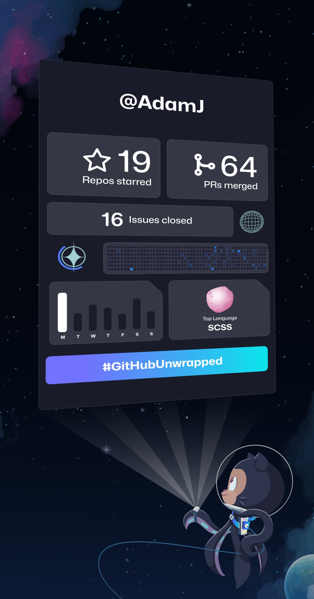

<h1>Hello there!</h1>

I am a user experience designer, based out of Massachusetts. I enjoy building user-centered, data-intensive designs to make user’s lives easier. You can find my work in products from Red Hat and Amazon, and through communities such as [Figma](https://www.figma.com/@adamj) and [GitHub](https://www.github.com/adamj).

  
  
  
  

<h2>Stats</h2>

  
  
  

  <picture>
    <source
      srcset="https://github-readme-stats.vercel.app/api/top-langs/?username=adamj&langs_count=5&hide_title=true&disable_animations=true&theme=dark"
      media="(prefers-color-scheme: dark)"
    />
    <source
      srcset="https://github-readme-stats.vercel.app/api/top-langs/?username=adamj&langs_count=5&hide_title=true&disable_animations=true"
      media="(prefers-color-scheme: light), (prefers-color-scheme: no-preference)"
    />
    
  </picture>

<!-- Icons from https://simpleicons.org -->
<!-- Badges from https://shields.io -->
<!-- Readme Stats from https://github.com/anuraghazra/github-readme-stats -->
